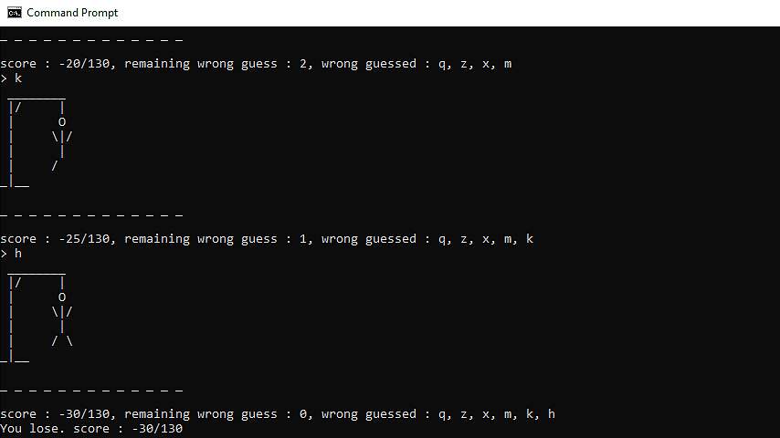

# The Internship Exam 2019 : Hangman

## How to play

* เริ่มเล่นเกมโดยทำการรันไฟล์ [hangman_game.jar](https://github.com/fpiyapol/The-Internship-Exam/tree/master/Hangman/release) โดยใช้คำสั่ง
```
java -jar hangman_game.jar
```

* จากนั้นให้ทำการเลือกหมวดหมู่คำที่ต้องการจะทาย โดยพิมพ์หมายเลขหมวดหมู่
    * 1.Car - เกี่ยวกับยี่ห้อรถยนต์
    * 2.Network - เกี่ยวกับระบบเครือข่าย

* เกณฑ์การคิดคะแนน
    * คะแนนเต็ม = จำนวนตัวอักษรของคำนั้นๆคูณ 10
    * เมื่อตอบถูกคะแนนจะเพิ่มขึ้นเท่ากับจำนวนตัวอักษรที่ปรากฎในคำคูณด้วย 10
    * เมื่อตอบผิดคะแนนจะลบ 5 (สามารถทายผิดได้ 6 ครั้ง)


